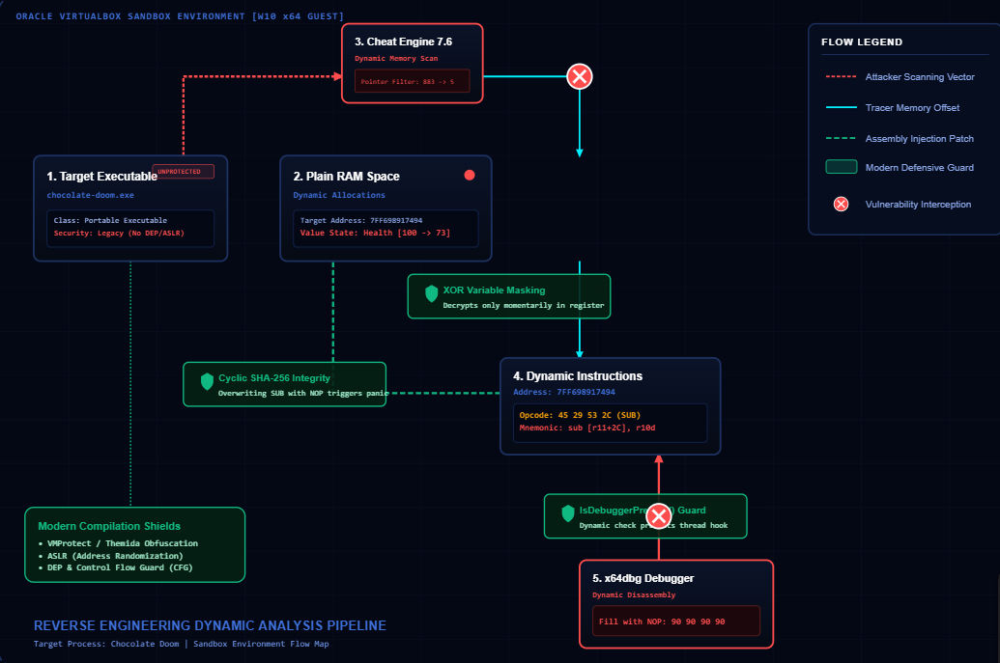
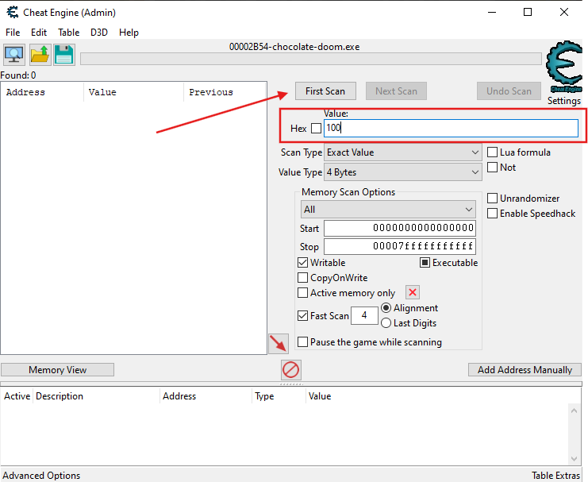
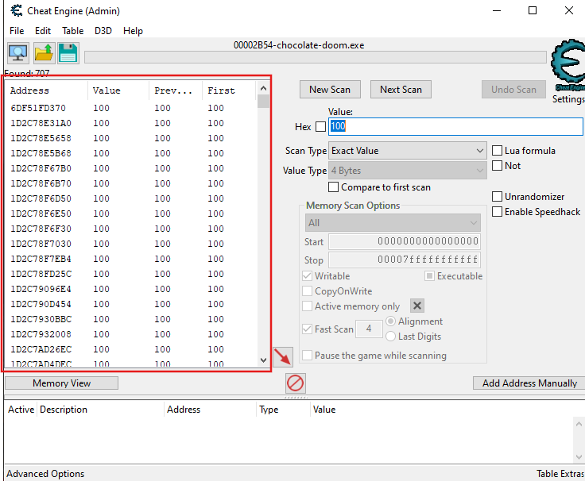
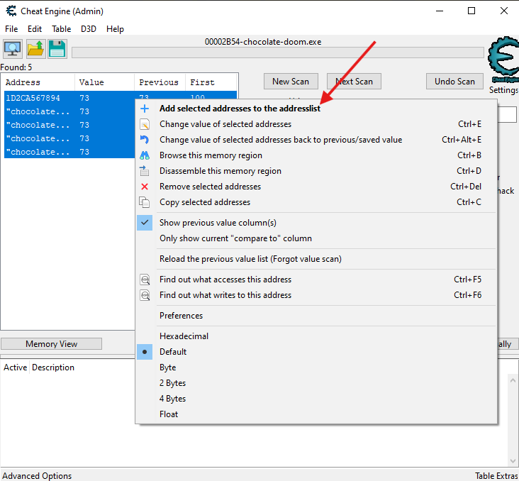
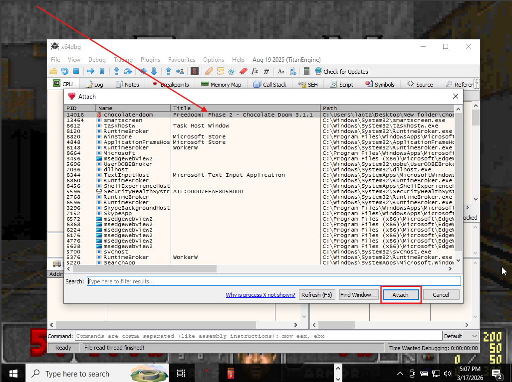
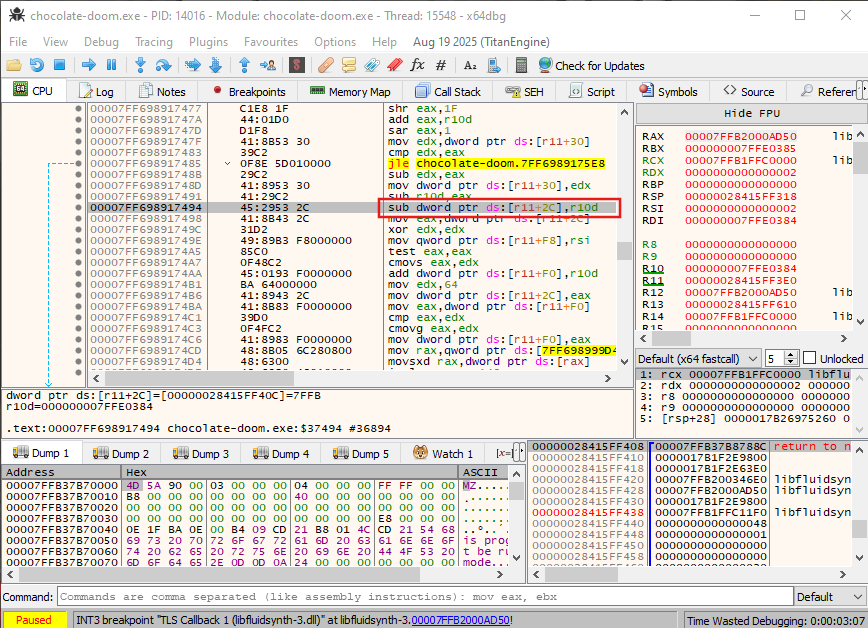
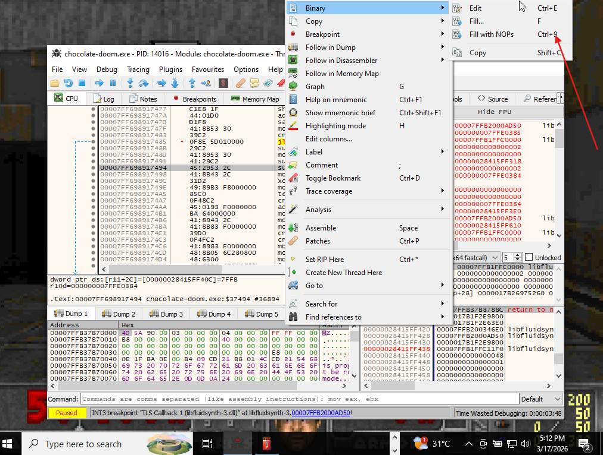

# Infinite Health Patch for Chocolate Doom (Freedom Edition)

**A complete step-by-step guide to finding and permanently patching the health subtraction in Chocolate Doom using Cheat Engine + x64dbg.**

---

## 📋 Table of Contents
- [Overview](#overview)
- [Prerequisites](#prerequisites)
- [Step 1: Setup](#step-1-setup)
- [Step 2: Cheat Engine Health Scan](#step-2-cheat-engine-health-scan)
- [Step 3: Find the Subtraction Instruction](#step-3-find-the-subtraction-instruction)
- [Step 4: Patch with x64dbg (Permanent Fix)](#step-4-patch-with-x64dbg)
- [Step 5: Verification](#step-5-verification)
- [Files Structure](#files-structure)
- [License](#license)

---

## Overview

This guide demonstrates how to:
1. Use **Cheat Engine** to locate the health value and the code that subtracts damage.
2. Use **x64dbg** to patch the `sub` instruction to `nop` (no operation) for infinite health.

**Game**: Chocolate Doom 3.1.1 running [Freedoom]([https://freedoom.github.io/](https://www.chocolate-doom.org/wiki/index.php/Chocolate_Doom) (free Doom IWAD replacement).

---

## Prerequisites

- Windows 10/11
- [Freedoom](https://freedoom.github.io/) WAD files (`freedoom1.wad`, `freedoom2.wad`)
- [Cheat Engine 7.6+](https://www.cheatengine.org/)
- [x64dbg](https://x64dbg.com/)

---

## Step 1: Setup

1. Download and extract Chocolate Doom.
2. Download Freedoom and copy `freedoom1.wad` + `freedoom2.wad` into the Chocolate Doom folder.
3. Launch the game and verify health displays correctly.

---

## Step 2: Cheat Engine Health Scan

### First Scan (Full Health)
- Launch Cheat Engine → Select Chocolate Doom process.
- Set value to your current health (e.g., `100`).
- **First Scan** → Exact Value → 4 Bytes.

### Damage & Next Scans
- Take damage → Note new health (e.g., `73`).
- **Next Scan** with updated value.
- Repeat until 4-5 addresses remain.

### Add to Address List & Test
- Select addresses → Right-click → **Add selected addresses**.
- Change value to `100` to test.

---

## Step 3: Find the Subtraction Instruction

1. Right-click the working address → **Find out what writes to this address**.
2. Take damage again.
3. Identify the `sub` instruction (e.g., `sub [r11+2C], r10d`).

---

## Step 4: Patch with x64dbg (Permanent)

### Attach x64dbg
- Run x64dbg as Administrator.
- Attach to `chocolate-doom.exe`.

### Locate & NOP the Instruction
- Go to the address from Cheat Engine.
- Replace `sub` with `nop` (90 in hex).
- Multiple NOPs may be needed.

### Save Patched Executable
- Modify binary → Save as new EXE.

---

## Step 5: Verification

- Launch patched executable.
- Health should no longer decrease when taking damage.

---

---

## ⚠️ Legal & Ethical Notice

- This is for **educational purposes** only.
- Use only on single-player/offline games you own.
- Respect game developers' work.

---

## Contributing

Pull requests welcome! Add more patches (ammo, armor, etc.).

---

**Made with ❤️ for the Doom community**

*Last updated: June 2026*

